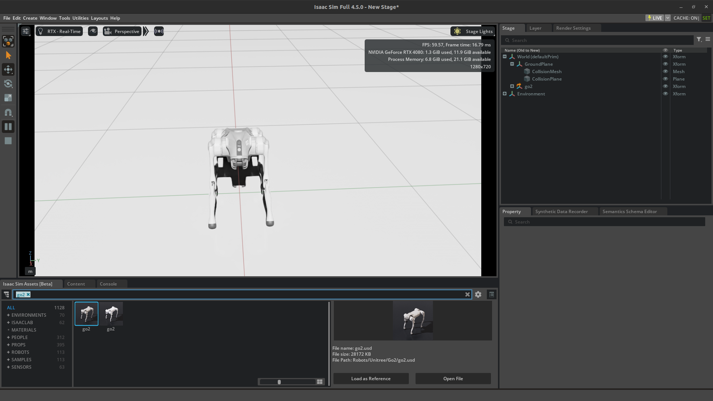

# quadrapedal


Learning how to manipulate the quadrapedal robot go2 in issac sim 

to start issac-sim 

```
bash issac-sm.sh

```


after adding the robot in the issac sim 





To install the go2_issac_ros2 github repo we need to install the required items in python 

- catkin_pkg
- empy (likely version 3.3.4 if the installation was successful)
- numpy
- lark


For that repo i got an irror for import issaclab for that i just downloades issaclab and install all required

https://isaac-sim.github.io/IsaacLab/main/source/setup/installation/pip_installation.html

for this URL

- it took for a while to load the robot like 5 mins

